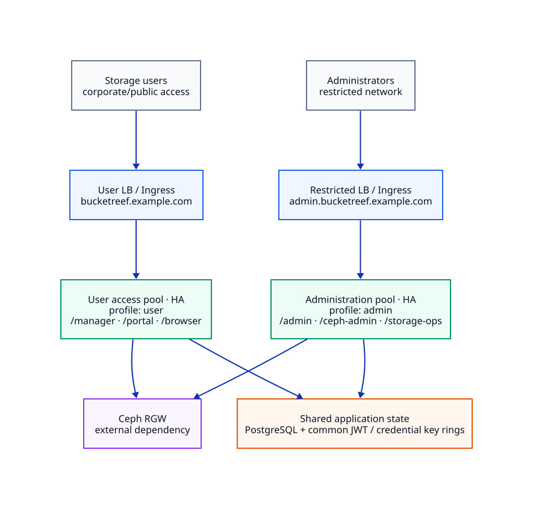
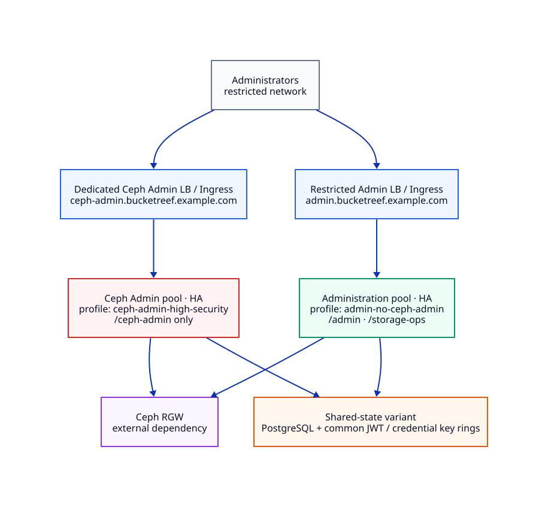
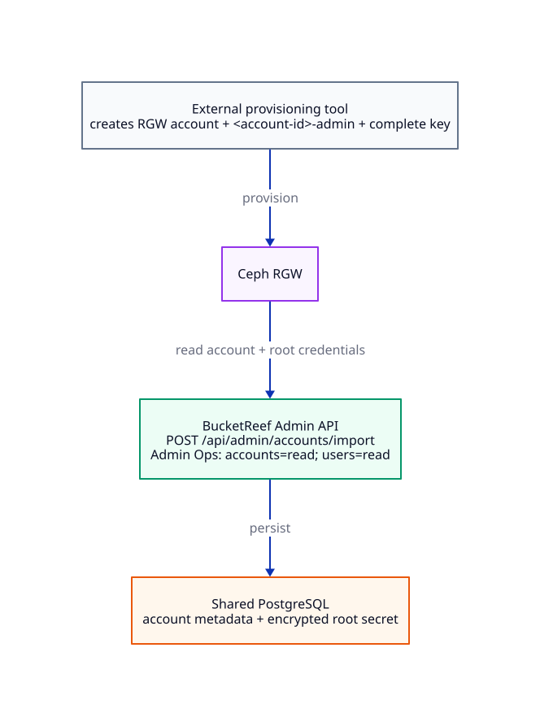

# Recommended production architecture

For production, split BucketReef administration from day-to-day user access.
Run each runtime pool with multiple instances behind its own ingress and use a
shared PostgreSQL database as the application source of truth.

## Standard production topology

[](../assets/diagrams/deployment-architecture/recommended-topology.svg)

The standard topology has two BucketReef runtime pools:

- **Administration pool** behind a restricted host such as
  `admin.bucketreef.example.com`. The `admin` deployment profile mounts
  `/admin`, `/ceph-admin`, and `/storage-ops` and owns scheduled jobs.
- **User access pool** behind the user-facing host such as
  `bucketreef.example.com`. The `user` deployment profile mounts `/manager`,
  `/portal`, and `/browser` and does not own scheduled jobs.

Run two or more backend/frontend instances per pool when high availability is
required. Both pools must point at the same PostgreSQL database and use the same
UI JWT, API JWT, and credential key rings so identities, sessions, encrypted
credentials, endpoint configuration, and application state remain coherent.
SQLite is not a supported database for this split multi-instance topology.

Configure the exact public origins for both hosts and a common WebAuthn RP ID
valid for those hosts. Restrict the Administration ingress at the network layer
to the intended administrator population. The User access ingress can follow
the organization's normal user exposure policy.

The deployment profiles enforce the surface split with runtime feature locks
such as `FEATURE_ADMIN_ENABLED`, `FEATURE_CEPH_ADMIN_ENABLED`,
`FEATURE_MANAGER_ENABLED`, `FEATURE_PORTAL_ENABLED`, and
`FEATURE_BROWSER_ENABLED`. Common authentication/profile APIs still exist where
required by each profile and are omitted from the diagram for clarity.

Ceph RGW is intentionally shown as one external dependency. User runtimes use
S3/IAM according to the selected execution context. Administration runtimes use
RGW Admin Ops only for features that require it; do not grant write caps merely
because the endpoint is registered in BucketReef.

## High-security Ceph Admin alternative

When Ceph RGW administration needs its own network and runtime boundary, replace
the standard Administration profile with `admin-no-ceph-admin` and run Ceph
Admin in a separate `ceph-admin-high-security` release or Compose project.

[](../assets/diagrams/deployment-architecture/high-security-topology.svg)

In this model:

- `admin-no-ceph-admin` mounts `/admin` and `/storage-ops`, owns scheduled jobs,
  and explicitly disables `/ceph-admin`;
- `ceph-admin-high-security` mounts only `/ceph-admin` plus the small set of
  authentication/profile routes required by that runtime and never owns
  scheduled jobs;
- the dedicated Ceph Admin ingress should have its own restricted network path;
- the User access pool stays unchanged from the standard topology;
- the diagram focuses on the Administration/Ceph Admin split and shows the
  **shared-state** variant, where these runtimes reuse the same PostgreSQL
  database and application key rings as the User access pool.

The two Ceph Admin placements are alternatives. If the dedicated
`ceph-admin-high-security` pool is the intended security boundary, do not keep a
normal `admin` runtime exposing `/ceph-admin` in parallel; use
`admin-no-ceph-admin` for the main administration release.

For a stronger trust boundary, the dedicated Ceph Admin runtime can instead use
its own PostgreSQL database and distinct key rings. That model requires a
separate administrator identity/bootstrap and is covered in
[Ceph Admin high-security deployment](ceph-admin-high-security.md).

When the high-security runtime shares the identity database and passkeys with
the main deployment, include every browser origin in the trusted public and
WebAuthn origin sets and use a common WebAuthn RP ID that covers those hosts.

## Helm contract for this topology

The chart ships small profile overlays:

- `values-admin.yaml` selects `deploymentProfile=admin`;
- `values-admin-no-ceph-admin.yaml` selects
  `deploymentProfile=admin-no-ceph-admin`;
- `values-user.yaml` selects `deploymentProfile=user`;
- `values-ceph-admin-high-security.yaml` selects
  `deploymentProfile=ceph-admin-high-security`.

These files select runtime surfaces only. They do **not** configure production
hosts, replica counts, PostgreSQL, Secrets, TLS, trusted proxies, origins, or
NetworkPolicy selectors/egress. Supply those settings in operator-owned values
files for each release.

For the recommended HA split, each operator values file should at least define
the release-specific ingress host/TLS settings, `backend.replicas` and
`frontend.replicas`, `backend.databaseType=postgresql`,
`backend.persistence.enabled=false`, `backend.existingSecret`, the exact
trusted proxy CIDRs, the shared public/WebAuthn origin contract, and the strict
NetworkPolicy selectors and required egress rules. If PostgreSQL or RGW lives on
a private network, add only its exact CIDR/port under
`networkPolicy.privateEgress`.

The referenced `backend.existingSecret` is the source of `DATABASE_URL` and the
JWT/credential key rings. Do not put `DATABASE_URL` or those key rings in
`backend.env`; chart rendering rejects that configuration.

See [Deploy with Helm](deploy-helm.md) for concrete values and rendering rules.

## Strict RGW account provisioning with read-only Admin Ops

Organizations that do not want the BucketReef endpoint Admin Ops identity to
create RGW accounts can provision them in an external trusted workflow and then
import them into BucketReef.

[](../assets/diagrams/deployment-architecture/strict-account-import.svg)

The existing `POST /api/admin/accounts/import` path supports this model without
an API change when the RGW resources are prepared completely before the import:

1. The external provisioning tool creates the RGW account.
2. It creates the account-root RGW user expected by BucketReef, named
   `<RGW_ACCOUNT_ID>-admin`, and ensures that user has one complete access-key
   pair available through RGW Admin Ops.
3. BucketReef validates the account with Admin Ops, reads that root user and
   obtains its existing key pair.
4. BucketReef stores the account locally. The secret key is persisted through
   BucketReef's encrypted credential field and therefore depends on the shared
   credential key ring.

For **this pre-provisioned import path only**, the endpoint Admin Ops identity
can be restricted to:

```text
accounts=read; users=read
```

No RGW write is required when both the expected account-root user and a complete
key already exist. If the root user is missing, BucketReef's current import
fallback attempts to create it. If the user exists without a complete key,
BucketReef attempts to create a key. Those fallbacks require `users=write` and
must not be considered compatible with the read-only profile.

Native account provisioning from BucketReef is a different workflow. It creates
the RGW account and its root identity and therefore requires at least
`accounts=read,write` and `users=read,write`. Features such as delegated bucket
quota changes or Ceph Admin operations can require additional RGW capabilities;
the read-only caps above are not a general replacement for their documented
permissions.

The external-provisioning model removes RGW **write capabilities from the
endpoint Admin Ops identity** used by the import path. BucketReef still stores
the imported account's root credentials because Manager and Portal account
workflows use that explicit storage execution identity.

## Deployment notes

- With Helm, deploy the profile appropriate to each pool as separate releases
  with distinct ingress hosts and one shared PostgreSQL/key-ring contract.
- With Docker Compose, use distinct project names and the matching profile
  overlays. For the high-security alternative, pair
  `docker-compose.admin-no-ceph-admin.yml` with a separate
  `docker-compose.ceph-admin-high-security.yml` project.
- Run scheduled jobs from the Administration deployment only.
- Apply network policy or firewall rules so Administration and dedicated Ceph
  Admin ingresses are reachable only from their intended operator networks.
- Back up PostgreSQL and preserve the credential key ring together; losing the
  key ring makes encrypted stored secrets unusable.

## Related pages

- [Deploy with Helm](deploy-helm.md)
- [Deploy with Docker Compose](deploy-docker-compose.md)
- [Production readiness](production-readiness.md)
- [Ceph Admin high-security deployment](ceph-admin-high-security.md)
- [Backends: Ceph RGW](backends-ceph-rgw.md)
- [Configuration](configuration.md)
